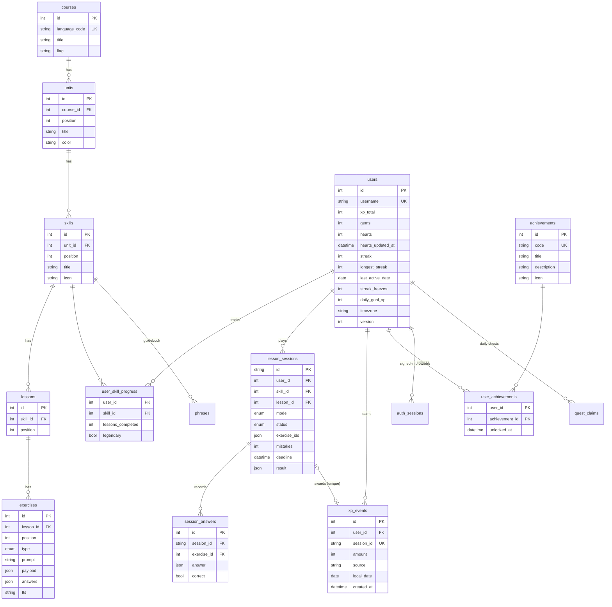

# Duolingo Clone — Spanish, French, Japanese & Hindi

**Live demo:** https://duolingo-clone-scalerai.vercel.app · **Source:** https://github.com/aadij1905/duolingo_clone_scalerai

A full-stack, multi-user clone of the Duolingo web app: four courses (🇪🇸 🇫🇷 🇯🇵 🇮🇳), the winding learning path with an easy-start difficulty ramp, a lesson player with eight exercise types (including listening and speaking) and the signature feedback bar, word hints, plus XP, streaks (with Streak Freezes), hearts that regenerate, daily quests with chests, weekly leagues with promotion, achievements, a gem shop, a timed **Legendary** challenge, a guidebook, mistakes review and dark mode.

| | |
|---|---|
| **Frontend** | Next.js 16 (App Router) + TypeScript, plain CSS (design tokens + CSS modules), no UI libraries |
| **Backend** | Python 3.13, FastAPI, SQLAlchemy 2, Pydantic 2 |
| **Database** | SQLite (WAL mode, foreign keys enforced) |
| **Tests** | pytest: 59 tests (game rules, HTTP API, accounts, languages, edge cases) · Playwright: onboarding + a full Japanese lesson in Chrome |

---

## Quick start

Prerequisites: Python 3.11+ and Node 20+.

```bash
# 1. Backend  (http://127.0.0.1:8000, interactive docs at /docs)
cd backend
python3 -m venv .venv && source .venv/bin/activate
pip install -r requirements-dev.txt
uvicorn app.main:app --reload --port 8000
```

```bash
# 2. Frontend  (http://localhost:3000)
cd frontend
npm install
npm run dev
```

The database is created and seeded automatically on first boot. To rebuild it from scratch: `python -m app.seed`.

```bash
# Tests
cd backend && pytest -q
cd frontend && npm run lint && npm run build
cd frontend && npm run test:e2e   # both servers running; uses your installed Chrome
```

**Google sign-in (optional):** in Google Cloud Console → APIs & Services → Credentials, create an *OAuth client ID* of type *Web application* and add `http://localhost:3000` (and your deployed frontend URL) under *Authorized JavaScript origins*; no redirect URI is needed. Start the backend with `GOOGLE_CLIENT_ID=<that id>`. The "Continue with Google" button appears on the welcome page and in Settings only when it's set.

Open http://localhost:3000: a new browser starts as a guest and goes through onboarding. To see a learner with history, choose **Explore the demo account** on the welcome page.

The frontend proxies `/api/*` to the backend (`next.config.ts`). Set `BACKEND_URL` if the API isn't on `127.0.0.1:8000`.

---

## Feature checklist

| Requirement | Where |
|---|---|
| Learning path: units, skills, locked / active / completed states | `services/course.py`, `components/LearningPath.tsx` |
| Progress rings + crowns per skill, top bar (streak, XP/gems, hearts) | `LearningPath.tsx`, `Shell.tsx` (`StatsBar`) |
| Lesson player: multiple choice, word-bank translate, match pairs, fill in the blank, type the answer | `components/exercises/*` |
| Instant correct/incorrect feedback bar, progress bar, combo ("5 IN A ROW") | `LessonPlayer.tsx` |
| Hearts: lose one per mistake, out-of-hearts modal, regenerate over time, refill via practice or gems | `services/hearts.py`, `services/sessions.py` |
| XP on completion, skill progress, daily goal, streak | `services/sessions.py#complete` |
| Streak increments on daily activity; day logic simulated and testable | `services/streak.py`, `clock.py`, Settings → *Demo controls* |
| Leaderboard (live, weekly, across seeded learners) | `services/leaderboard.py`, `/leaderboard` |
| Content (units → skills → lessons → exercises) stored in the DB and seeded | `models.py`, `seed.py` |
| Profile with stats, weekly XP chart and achievements | `/profile` |
| Modals, toasts, confetti, mascot reactions, settings placeholders | `Modal.tsx`, `Providers.tsx`, `Mascot.tsx` |
| **Bonus:** audio (Web Speech TTS + synthesized sound effects) | `lib/sound.ts` |
| **Bonus:** achievements / badges | `services/achievements.py` |
| **Bonus:** real leaderboard across seeded users | `services/leaderboard.py` |
| **Bonus:** Legendary timed challenge (2:30, max 3 mistakes, no hearts) | `sessions.py`, `/practice` |
| **Bonus:** dark mode (system / light / dark) | `globals.css` tokens, Settings |
| **Bonus:** responsive: phone (bottom nav), tablet (icon sidebar), desktop (sidebar + right rail) | `shell.module.css` |
| **Multi-user:** guest per browser, register / sign in / sign out, leagues of real learners + bots | `services/auth.py`, `routers/auth.py`, Settings → Account |
| Four courses (Spanish, French, Japanese, Hindi) from one topic list; Japanese accepts kanji/kana, hiragana or romaji | `content.py`, `seed.py`, `grading.py` |
| Onboarding (language, daily goal) and a course switcher on the flag | `/welcome`, `Shell.tsx` |
| Easy start: short early lessons, exercise mix grows by unit, beginner protection, word hints, typo tolerance | `seed.py#STAGES`, `parts.tsx#HintText`, `grading.py` |
| Listening (tap / type what you hear, 🐢 slow) and speaking (speech recognition, server-graded); "Can't listen/speak now" | `exercises/Listen*.tsx`, `Speak.tsx`, `LessonPlayer.tsx` |
| Practice hub: listening, speaking, mistakes review | `services/sessions.py`, `/practice` |
| Guidebook, daily quests with chests, streak calendar, league promotion/demotion | `course.py`, `quests.py`, `/profile`, `leaderboard.py` |
| Placeholders ("Coming soon"): Super, unlimited hearts, friends, notifications | Shop, Settings |

---

## Architecture

```
Browser ── Next.js (React client components) ──/api/* rewrite──▶ FastAPI
                                                                   │
              routers/   HTTP only: parse, validate, call a service, shape JSON
                 │
              services/  business rules (pure-ish, no FastAPI imports)
                 │          course · sessions · grading · hearts · streak · xp
                 │          achievements · leaderboard · shop · auth · quests
              models.py  SQLAlchemy ORM ─────────▶ SQLite
```

```
backend/app
├── main.py            app wiring: middleware, error mapping, routers, startup seed
├── config.py          every tunable (economy, CORS, DB URL) in one place, env-overridable
├── db.py              engine (SQLite pragmas), session-per-request dependency
├── clock.py           injectable clock (time travel for demos/tests)
├── deps.py            current_user from the session cookie (+ lazy settle of hearts/streak/league)
├── models.py          schema
├── schemas.py         request validation
├── content.py         topics, words and sentences, translated into every course language
├── seed.py            exercise generator (difficulty stages), demo learner, rival bots
├── routers/           auth · me · course · sessions · social · quests · shop · dev
└── services/          the game rules
frontend/src
├── app/(main)/        pages inside the app shell: learn, practice, leaderboard, quests, shop, profile, settings
├── app/lesson/        full-screen lesson player route
├── components/        Shell, LearningPath, LessonPlayer, exercises/*, Mascot, Icons, Modal, Providers
└── lib/               api.ts (typed client), sound.ts (SFX + TTS)
```

### The lesson loop (server-authoritative)

1. `POST /api/sessions {skill_id, mode}`: the server checks the skill is unlocked and hearts > 0, then picks the exercises and stores a `LessonSession`. Accepted answers are **never** sent to the client.
2. `POST /api/sessions/{id}/answers` grades one answer. A miss costs a heart; the client re-queues it at the end of the lesson, like Duolingo. Hearts at 0 fail the session.
3. `POST /api/sessions/{id}/complete` succeeds only if every exercise has a correct answer. It awards XP, gems, the daily-goal bonus, the streak and achievements, then caches the result. Replaying it returns the same result (idempotent).

---

## Database schema



Phase 2 added: `courses.tts_locale` / `word_spacing`; `exercises.type` + `listen_tap`, `listen_type`, `speak`; `users.password_hash`, `is_bot`, `onboarded`, `league_tier`, `league_week`; `lesson_sessions.no_heart_loss`; new tables `phrases`, `auth_sessions (token_hash PK)`, `quest_claims (user_id, day, code) PK`. Each skill also has a hidden lesson at position −1 holding its listening/speaking drill exercises, so practice has material without touching the path. There are no migrations: when the schema version (`PRAGMA user_version`) changes, the SQLite file is rebuilt and re-seeded on boot.

Design decisions:
- **Content vs learner state are separate tables.** Content is shared and read-only; progress is per user. `(parent_id, position)` unique constraints keep ordering unambiguous.
- **`exercises.payload` / `answers` are JSON.** Each exercise type has a different shape (options, word bank, pairs…), so one polymorphic table with a typed `type` enum avoids five near-identical tables. `answers` holds every accepted translation.
- **XP ledger (`xp_events`).** It's the source of truth for "XP today" (daily goal), "XP this week" (league) and the profile chart; `users.xp_total` is a denormalized total for cheap reads. Indexed on `(user_id, local_date)` and `created_at`.
- **`xp_events.session_id` is UNIQUE.** The database itself guarantees a lesson can't pay out twice.
- **`users.version` = optimistic locking.** Concurrent writes to the same learner (two tabs, double-submits) can't silently overwrite each other. The loser gets HTTP 409 and the client retries once.
- **Local dates.** Streaks and daily goals use the learner's timezone (`users.timezone`, auto-detected from the browser). Changing timezone shifts `last_active_date` so travelling never costs a streak day.

---

## API overview

| Method | Path | Purpose |
|---|---|---|
| GET | `/api/health` | liveness |
| POST | `/api/auth/guest` | create a guest learner for this browser (sets the HttpOnly cookie) |
| POST | `/api/auth/register` | add username + password to the current learner |
| POST | `/api/auth/login` · `/api/auth/logout` | sign in / out |
| GET | `/api/auth/config` · POST `/api/auth/google` | Google sign-in: client id for the button; verify an ID token (links a guest's progress, or signs in) |
| GET | `/api/courses` | every course with this learner's progress |
| GET | `/api/units/{id}/guidebook` | key words and sentences per skill |
| GET | `/api/quests` · POST `/api/quests/{code}/claim` | daily quests; claim a chest once per day |
| GET | `/api/me` | top-bar state: XP, gems, hearts (+ next heart time), streak, freezes, daily XP/goal |
| PATCH | `/api/me` | settings: `daily_goal_xp` (10/20/30/50), `display_name`, `timezone`, `course_id`, `onboarded` |
| GET | `/api/me/profile` | stats, 7-day XP chart, achievements |
| GET | `/api/path` | course → units → skills with `locked/active/completed`, lessons done, legendary flag |
| POST | `/api/sessions` | start `lesson` / `practice` (`kind`: mix, listening, speaking, mistakes) / `legendary` → exercises (no answers) |
| POST | `/api/sessions/{id}/answers` | grade one answer (or `skip` a listening/speaking one) → `{correct, typo, solution, hearts, status}` |
| POST | `/api/sessions/{id}/complete` | finish → XP, gems, streak, daily goal, new achievements (idempotent) |
| GET | `/api/leaderboard` | weekly league standings with promotion/demotion zones |
| GET | `/api/shop` | prices |
| POST | `/api/shop/heart-refill` | 350 gems → full hearts |
| POST | `/api/shop/streak-freeze` | 200 gems → +1 freeze (max 2) |
| GET/POST | `/api/dev/clock`, `/api/dev/time-travel`, `/api/dev/reset`, `/api/dev/demo` | demo controls: shared clock, reset my progress, sign in as the sample learner (disable with `ENABLE_DEV_ROUTES=0`) |

Errors are always `{"error": "<code>", "message": "..."}` with a meaningful status: 401 not signed in, 402 not enough gems, 403 locked, 404, 409 rule conflict (`out_of_hearts`, `incomplete`, `time_up`, `conflict`…), 422 validation.

---

## Game rules (all in `config.py`)

| Rule | Value |
|---|---|
| Lesson XP | 10, +5 for a perfect lesson |
| Practice | 10 XP, +1 heart, never costs hearts |
| Legendary | 40 XP, 10 questions, 2:30 timer, fail on the 4th mistake, no hearts used |
| Hearts | max 5, −1 per wrong answer, +1 every 30 min (`HEART_REGEN_MINUTES`). The first 2 lessons of a course are free |
| Gems | +5 per session, +20 when the daily goal is hit |
| Streak | +1 on the first session of a local day. A missed day uses a Streak Freeze automatically if you have one, otherwise the streak resets |
| Unlocks | linear path: a skill unlocks when every earlier skill is complete |
| League | Bronze → Silver → Gold → Sapphire → Ruby, weekly (Monday 00:00 UTC), top 7 promote, bottom 5 demote, settled on the first read of a new week |
| Grading | case, accents, punctuation and spaces ignored; typed answers forgive one typo; speaking needs ≥ 75% similarity |
| Quests | earn the daily goal (+10 gems), 2 lessons (+15), a perfect lesson (+20) |

---

## Design principles applied

**System design**
- **Server-authoritative state**: grading, hearts, XP and timers are decided on the server. The client never predicts currency or score; it re-reads after each mutation.
- **Idempotency**: `/complete` caches its result, plus a UNIQUE ledger key, so double-clicks and retries are safe.
- **Optimistic concurrency control**: a version column on `users`, mapped to 409 and a single client retry.
- **Lazy evaluation instead of background jobs**: heart regeneration and missed streak days are "settled" from timestamps when a learner is read. There's no cron or worker, and the result is exact after any downtime.
- **Event ledger + denormalized counter**: `xp_events` for history and windows, `xp_total` for O(1) reads.
- **Query efficiency**: the course tree loads with `selectinload` (3 queries, no N+1), and hot lookups are indexed.
- **Validation at the trust boundary**: Pydantic bounds every input (answer length, pair shape, goal values, IANA timezones).
- **Injectable clock**: deterministic tests plus a "time travel" demo control for day-based logic.
- **Same-origin API proxy**: one public URL, no CORS preflights in production.
- **Config via env**, a health check, gzip, consistent error envelope.

**SOLID**
- **S**: routers do HTTP, services do rules, models do persistence. Each service owns one concept (hearts, streak, xp…).
- **O**: exercise grading is a registry of strategies (`@grader(ExerciseType.x)`); achievements are declarative rules. On the client, `exercises/index.tsx` maps type → widget. Adding a type or badge doesn't modify the session engine.
- **L**: every exercise widget honours the same `ExerciseProps` contract, so the player treats them interchangeably.
- **I**: widgets receive only `exercise / onChange / locked`; services take only what they need (`User`, `Clock`), not the whole request.
- **D**: routers depend on `get_db`, `get_clock` and `current_user` abstractions via FastAPI `Depends`; tests swap them for a temp DB and a controllable clock. Swapping the default learner for real auth is a change to one function.

---

## Assumptions & simplifications

- **Accounts** are username + password, or Google: no email verification, password reset or login rate limiting. Google ID tokens are checked with Google's tokeninfo endpoint (one call per sign-in). Guests that never register stay in the database (add a cleanup job if that matters).
- **The demo clock is global**: time travel moves every learner's day. Turn dev routes off (`ENABLE_DEV_ROUTES=0`) for a public deployment.
- **Four courses** for English speakers (Hindi and Japanese accept their own script or romanization), generated from one topic list (`content.py`): 3 units, 9 skills and 27 lessons each. Exercises are generated deterministically, so content is easy to extend. Speech uses the browser: voice quality depends on the OS, and speaking needs Chrome, Edge or Safari (Firefox skips it automatically).
- **Gems are mocked**; Super / unlimited hearts / speaking / friends are "Coming soon" placeholders.
- **Audio** uses the browser's speech synthesis (voice quality depends on the OS) and Web Audio tones, so there are no audio files.
- **Rivals** are seeded learners whose weekly XP is generated deterministically each week, so the league is never empty.
- **The mascot** ("Lingo") and icons are original SVGs inspired by Duolingo's style, not Duolingo assets. Nunito stands in for Duolingo's proprietary Feather font.
- **SQLite** suits a single-instance deployment. For multiple instances, switch `DATABASE_URL` to Postgres: the code uses SQLAlchemy and needs no changes.

---

## Deployment

**Backend → Railway**: new service from the repo, root directory `backend/`. Railway installs `requirements.txt`, uses Python from `.python-version` and starts the command in `Procfile`. To keep accounts across redeploys, attach a volume (e.g. at `/data`) and set `DATABASE_URL=sqlite:////data/duolingo.db`; without one, the SQLite file is re-created and re-seeded on every deploy. Recommended env vars: `RESET_DB_ON_SCHEMA_CHANGE=0` (never wipe real accounts), `COOKIE_SECURE=1`, and optionally `GOOGLE_CLIENT_ID`.

**Frontend → Vercel**: import the repo, root directory `frontend/`, env var `BACKEND_URL=https://<your-service>.up.railway.app`. All browser calls go to `/api/*` on the Vercel domain and are proxied to the backend, so the session cookie is first-party.

**Google sign-in**: add the Vercel URL to the OAuth client's *Authorized JavaScript origins*.
